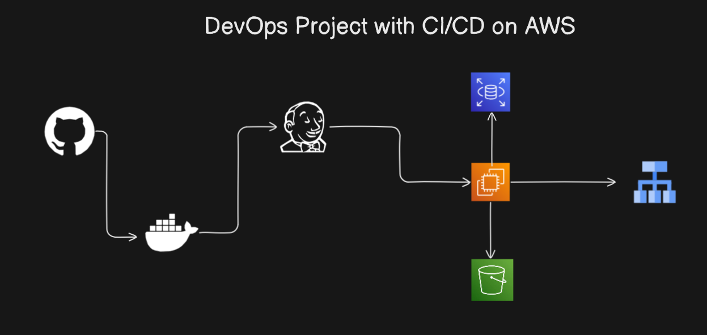

# DevOps Project - CI/CD Pipeline with AWS RDS, Docker, Jenkins, and EC2

## Architecture Diagram

## Overview

Welcome to the **DevOps Project** by Jibran! This project demonstrates a seamless CI/CD pipeline setup using Jenkins, Docker, AWS RDS, and EC2. It is designed to showcase best practices in DevOps, focusing on automation, containerization, and cloud-based deployment. The pipeline is set up to automatically deploy a Node.js application with CRUD operations for user management, utilizing AWS RDS for database storage, Docker for containerization, and Jenkins for continuous integration and delivery.

## Key Features

- **CI/CD Pipeline**: Fully automated build, test, and deployment pipeline.
- **Docker**: Containerization of the application for easy deployment and scalability.
- **AWS RDS**: Relational Database Service (RDS) for managing user data in a cloud environment.
- **AWS S3**: Integration with S3 for storing and retrieving user files.
- **EC2 Deployment**: Seamless deployment of the application to AWS EC2 instances.
- **Jenkins Integration**: Continuous integration and continuous delivery (CI/CD) pipeline powered by Jenkins.
  
## Project Setup

Follow these steps to set up the project locally and run the CI/CD pipeline.

### Prerequisites

Before you begin, ensure that you have the following:

- **AWS Account** with S3, EC2, and RDS access.
- **Docker** installed on your local machine.
- **Jenkins** server set up with AWS credentials configured.
- **Git** installed for version control.
 
### Jenkins Pipeline

The Jenkins pipeline is configured with the following stages:

1. **Checkout**: Clone the GitHub repository.
2. **Install Dependencies**: Install necessary npm packages.
3. **Build Docker Image**: Build the Docker image for the application.
4. **Push to ECR**: Authenticate with AWS ECR and push the Docker image to the registry.
5. **Deploy to EC2**: SSH into the EC2 instance and deploy the Docker container.

---

## How to Star the Repository
If you find this project helpful, please star the repository on GitHub to show your support:
1. Click the ⭐ button in the top-right corner.

---

## Author
**Jibran**  
Passionate DevOps Engineer and Software Developer.
Connect with me on [LinkedIn](https://www.linkedin.com/in/muhammad-jibran220/).

---
 

## Feedback & Contributions
Contributions are welcome! Feel free to fork the repository and submit a pull request.

---
 

 

